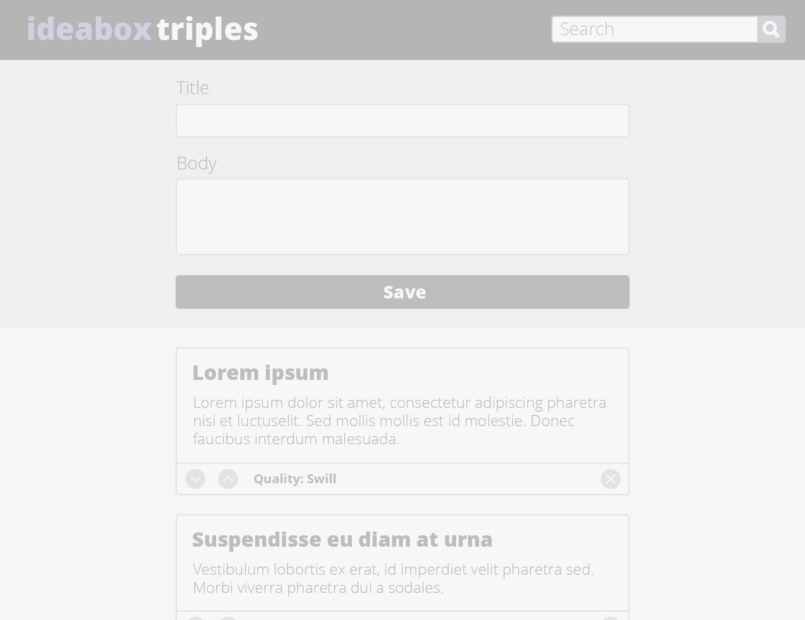

## IdeaBox Triples
This project was designed as a way of solidifying some specific javascript processes, as well as an html and css practice. The goal was to improve on building responsive client-side applications with good user feedback, understand how to implement client-side data persistence using localStorage, understand what it looks like to have a separate data model (using a class) and dom model, understand how to utilize data-* attributes, understand how to iterate over dom elements in order to filter what is being displayed, and understand how to craft code with clean style, using small functions that show trends toward DRYness and SRP.

This application allows a user to create an "idea" with a title and body text, use up and down buttons to change the "quality" of a targeted idea, click a delete button to delete a targeted idea, update ideas after they've been added, filter ideas by quality, and search for ideas in the search bar. Ideas (as well as any updates to that idea) are saved to local storage and persist on the DOM on pageload. 

Our greatest struggle was in trying to find a way for the DOM to display only the ten most recent ideas on page load. We knew we could use CSS to create a card field that could essentially hide overflow ideas, but we wanted to find a way to solve the problem with a JavaScript function. We attempted to reverse the idea array and then only iterate through that reversed array 10 times when appending ideas to the DOM, and also attempted to use the .length property to iterate through the last 10 indices in the array. Unfortunately, the closest we ever got was displaying the first ten ideas (rather than the ten most recent). 

## Screenshots
#### Provided Comp.

## Tech/framework used
<b>Built with</b>
- [Sublime Text Editor](https://sublimetext.com)
- HTML
- CSS
- JavaScript

## Credits
The participants in this project were Joshua Lavarine, Jacob Admire, and Taylor Sperry
